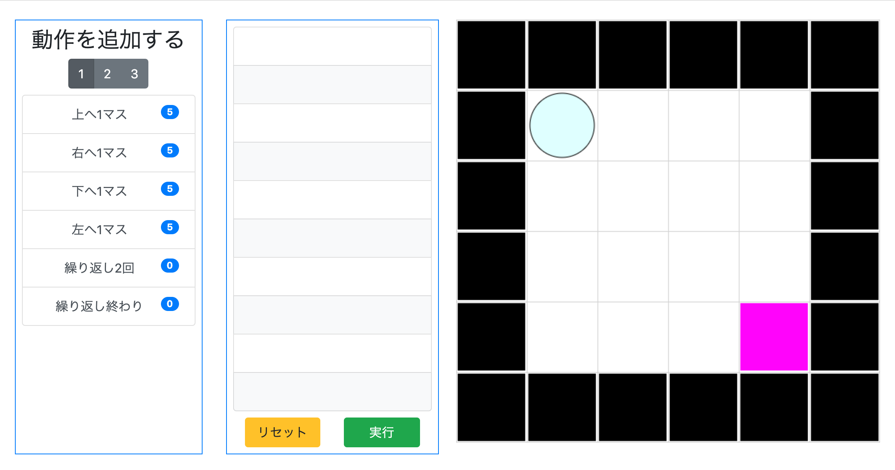

# Ball Control Game

## 概要
ボールをゴールに辿り着けるように、決められた動作を正しく並べて実行するゲームです。

[Webページ ](https://yunemk.github.io/Ball-Controll-Game/)

## 遊び方
* 左の動作一覧から動きを選択します。
* 真ん中のリストに動作を並べたら実行をクリックします。
* ボールが指定した通りに動きます。

## 注意点
* IE では動きません。
* 繰り返し機能はまだ使えません。
* 実行中にステージを変更するとバグります。

---
## コンセプト

>for 文を使ったアルゴリズム、アルゴリズムと数学の関係性、アルゴリズムと英字文章の関係性、チームワーク（コミュニケーション能力）の考え方を身につけてもらう

ことが形式的な目標です。

---
## ステージの情報
ステージ情報は *data/fieldSet.json* に記載しています。
```json
"stage-{number}": {
  "field": {
    "column": "列(1以上): number",
    "row": "行(1以上): number",
    "status": ["..."]
  },
  "ball": {
    "initPosX": "初期位置のX座標(0以上_column-1以下): number",
    "initPosY": "初期位置のY座標(0以上_row-1以下): number",
    "color": "ボールの色: string",
    "strokeColor": "輪郭の色: string"
  },
  "canvas": {
    "background": "画面の背景色: string"
  }
}
```
status: {column}x{row}の2次元配列
  * 0 (black): ボールが乗るとエラーが発生する
  * 1 (white): デフォルトのブロック
  * 2 (magenta): ボールが乗るとクリア
  * 3 (gold): ボールが乗ると olive ブロックにワープする (olive ブロックが必要, 1つだけ設定)
  * 4 (olive): gold ブロックに乗ったボールがワープして来る場所 (gold ブロックが必要, 1つだけ設定)

#### 初期値
* field.column: 12, field.row: 12
* field.status: undefined (必須項目です)
* ball.initPosX: 1, ball.initPosY: 1
* ball.color: "cyan", ball.strokeColor: "black"
* canvas.background: "#fff"

---

## 実装予定の機能
* 上下左右それぞれ n マス動く命令 (n = 1, 2, ...)
* 繰り返し動作
  * 実装方法: 繰り返し n 回 -> 上下左右に動く動作(複数可) -> 繰り返し終わり (n = 1, 2, ...)
* 命令の使用回数を制限する
  * Bootstrap の badge を使用する
* 数字と演算子を集めて演算する機能
  * 実装例: 「答えが3となるようにボールを動かそう」というお題を与えます。フィールドに散りばめられた「1」「2」「3」「+」「=」を「=」が最後となるよう記号を集めていきます。この場合、1+2= か 3= の順で集められるとゲームクリアとなります。
* フィールドにあるアルファベットを集めて単語を作る (上記と同様に)

## 使用した技術
Bootstrap, Canvas API
