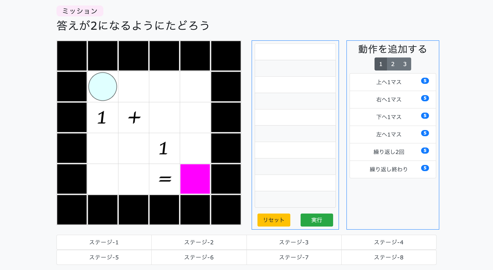

# Ball Control Game

## 概要
ボールをゴールに辿り着けるよう、決められた動作を正しく並べて実行するゲームです。

[Webページ ](https://yunemk.github.io/Ball-Controll-Game/)

## 遊び方
* 左の動作一覧から動きを選択します。
* 真ん中のリストに動作を並べたら実行をクリックします。
* ボールが指定した通りに動きます。

---

## ステージの情報
ステージ情報は *data/fieldSet.json* に記載しています。
* stage-{number}
* field
  * column: 列, row: 行
  * status: {column}x{row}の2次元配列 (0から数える)
    * 0 black: ボールが乗るとエラーが発生する
    * 1 white: デフォルトのブロック
    * 2 magenta: ボールが乗るとクリア
    * 3 gold: ボールが乗るとoliveブロックにワープする　(oliveブロックが必要, 1つだけ設定)
    * 4 olive: goldブロックに乗ったボールがワープして来る場所 (goldブロックが必要, 1だけ設定)
* ball
  * initPosX, initPosY: ボールの初期位置
  * color, strokeColor: ボールと輪郭の色
* canvas
  * background: 画面の背景色

### 初期値
* field.column:12, field.row: 12
* field.status: null (必須項目です)
* ball.initPosX: 1, ball.initPosY: 1
* ball.color: "cyan", ball.strokeColor: "black"
* canvas.background: "#fff"

## 実装したいこと
* 繰り返し動作
* ステージ選択

## 注意点
* IEでは動きません。
* 繰り返し機能はまだ使えません。
* レスポンシブデザインで作りましたが、不完全な部分があります。
